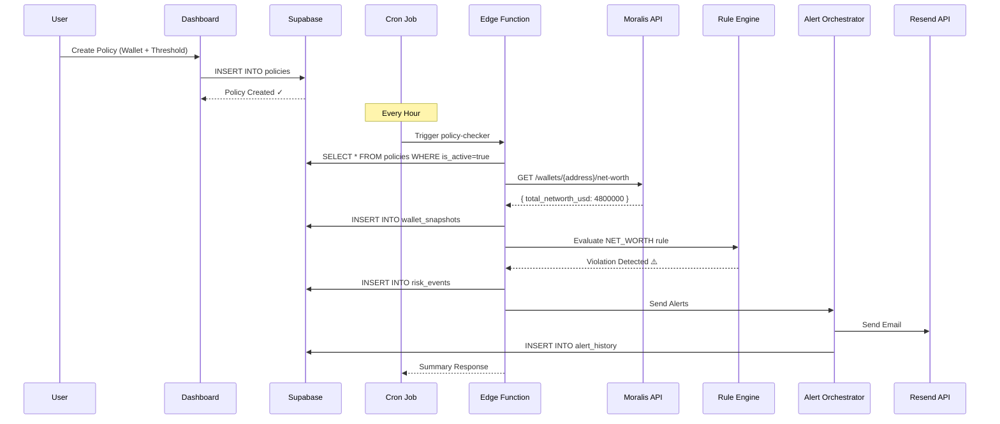

# RiskSignal: Production Architecture Documentation

## 🏗️ System Overview

RiskSignal is a **policy-driven blockchain risk monitoring platform** that continuously evaluates wallet state against user-defined rules and triggers multi-channel alerts when violations are detected.

```
┌──────────────────────────────────────────────────────────────┐
│                        USER LAYER                             │
│  ┌────────────┐  ┌────────────┐  ┌────────────┐             │
│  │ Dashboard  │  │  Policy    │  │  Risk Feed │             │
│  │   (Next)   │  │  Builder   │  │ (Real-time)│             │
│  └────────────┘  └────────────┘  └────────────┘             │
└────────────────────────┬─────────────────────────────────────┘
                         │ REST API + WebSocket
┌────────────────────────┴─────────────────────────────────────┐
│                    APPLICATION LAYER                          │
│  ┌──────────────────────────────────────────────────────┐   │
│  │           Supabase Edge Function (Deno)               │   │
│  │  • Policy Evaluator                                   │   │
│  │  • Rule Engine Registry                               │   │
│  │  • Blockchain Data Fetcher                            │   │
│  │  • Alert Orchestrator                                 │   │
│  └──────────────────────────────────────────────────────┘   │
└────────────────────────┬─────────────────────────────────────┘
                         │
┌────────────────────────┴─────────────────────────────────────┐
│                     DATA LAYER                                │
│  ┌───────────────────────────────────────────────────────┐  │
│  │          Supabase PostgreSQL (RLS Enabled)             │  │
│  │  • policies           • risk_events                    │  │
│  │  • wallet_snapshots   • alert_history                  │  │
│  │  • user_preferences                                    │  │
│  └───────────────────────────────────────────────────────┘  │
└────────────────────────┬─────────────────────────────────────┘
                         │
┌────────────────────────┴─────────────────────────────────────┐
│                   EXTERNAL SERVICES                           │
│  ┌──────────┐  ┌──────────┐  ┌──────────┐  ┌──────────┐   │
│  │ Moralis  │  │  Resend  │  │  Twilio  │  │  Slack   │   │
│  │   API    │  │  (Email) │  │  (SMS)   │  │(Webhooks)│   │
│  └──────────┘  └──────────┘  └──────────┘  └──────────┘   │
└──────────────────────────────────────────────────────────────┘
```

---

## 🧩 Core Components

### 1. Rule Engine (`lib/engine/`)

**Purpose**: Pluggable system for evaluating wallet state against policies.

**Key Files**:
- `rule-registry.ts` - Central registry for rule types
- `policy-evaluator.ts` - Orchestrates rule execution
- `rules/net-worth-rule.ts` - Balance threshold checker
- `rules/concentration-rule.ts` - Asset allocation enforcer
- `rules/unauthorized-token-rule.ts` - Whitelist validator

**Flow**:
```typescript
Policy → RuleRegistry.execute() → SpecificRule.execute() → RuleExecutionResult
```

**Adding New Rules**:
1. Create `rules/my-rule.ts` implementing `Rule<TConfig>` interface
2. Register in `engine/index.ts`: `ruleRegistry.register(new MyRule())`
3. Add policy type to database enum and Zod schema

---

### 2. Policy Evaluator (`lib/engine/policy-evaluator.ts`)

**Purpose**: Fetches blockchain data and evaluates all active policies.

**Key Methods**:
- `evaluatePolicy(policy)` - Single policy check
- `evaluatePolicies(policies[])` - Batch evaluation with error handling
- `createRiskEvents(results[])` - Transform violations into database records

**Usage**:
```typescript
const evaluator = new PolicyEvaluator({
  dataProvider: new MoralisDataProvider(apiKey),
  includeHistoricalData: true,
  historicalDays: 7
})

const results = await evaluator.evaluatePolicies(policies)
const events = evaluator.createRiskEvents(results)
```

---

### 3. Alert Orchestrator (`lib/services/alert-orchestrator.ts`)

**Purpose**: Intelligent multi-channel notification system with rate limiting and deduplication.

**Features**:
- **Multi-channel**: Email (Resend), SMS (Twilio), Slack (Webhooks)
- **Rate Limiting**: Max 3 alerts per hour per risk event
- **User Preferences**: Respects quiet hours, severity thresholds
- **Professional Templates**: HTML emails, formatted Slack blocks

**Usage**:
```typescript
const orchestrator = new AlertOrchestrator(resendKey, twilioSid, twilioToken)

await orchestrator.sendAlerts({
  riskEventId: 'uuid',
  walletAddress: '0x...',
  severity: 'HIGH',
  violationMessage: 'Balance dropped below $5M',
  recipientEmail: 'user@example.com'
}, userPreferences)
```

---

### 4. Supabase Edge Function (`supabase/functions/policy-checker/`)

**Purpose**: Serverless cron job that runs the entire risk detection pipeline.

**Execution Flow**:
1. **Authenticate** - Verify cron signature or Bearer token
2. **Fetch Policies** - Get all active policies from database
3. **Group by Wallet** - Minimize Moralis API calls
4. **Evaluate Rules** - Run policy evaluator for each wallet
5. **Store Snapshots** - Save historical data to `wallet_snapshots`
6. **Create Risk Events** - Log violations to `risk_events`
7. **Trigger Alerts** - Call alert orchestrator
8. **Return Summary** - JSON response with metrics

**Deployment**:
```bash
supabase functions deploy policy-checker --no-verify-jwt
```

---

### 5. Database Schema

#### **`policies`** - User-defined monitoring rules
```sql
CREATE TABLE policies (
  id UUID PRIMARY KEY,
  user_id UUID REFERENCES auth.users(id),
  wallet_address TEXT NOT NULL,
  policy_type policy_type NOT NULL,  -- ENUM
  policy_name TEXT NOT NULL,
  config JSONB NOT NULL,  -- Type-specific parameters
  severity severity_level NOT NULL,  -- ENUM
  is_active BOOLEAN DEFAULT TRUE,
  created_at TIMESTAMPTZ,
  updated_at TIMESTAMPTZ
);
```

**Example Policy Configs**:
```json
// Net Worth Policy
{
  "type": "NET_WORTH",
  "threshold": 5000000,
  "currency": "USD",
  "comparison": "LESS_THAN"
}

// Asset Concentration Policy
{
  "type": "ASSET_CONCENTRATION",
  "asset_symbol": "PEPE",
  "max_percentage": 5,
  "include_stablecoins": false
}

// Unauthorized Token Policy
{
  "type": "UNAUTHORIZED_TOKEN",
  "whitelist": ["0x...", "0x..."],
  "check_mode": "STRICT"
}
```

#### **`risk_events`** - Historical violations
```sql
CREATE TABLE risk_events (
  id UUID PRIMARY KEY,
  policy_id UUID REFERENCES policies(id),
  wallet_address TEXT NOT NULL,
  event_type policy_type NOT NULL,
  severity severity_level NOT NULL,
  status event_status NOT NULL,  -- OPEN, ACKNOWLEDGED, RESOLVED
  violation_data JSONB NOT NULL,
  detected_at TIMESTAMPTZ,
  resolved_at TIMESTAMPTZ
);
```

**Example Violation Data**:
```json
{
  "type": "NET_WORTH",
  "current_balance": 4800000,
  "threshold": 5000000,
  "difference": 200000,
  "percentage_change": -4.0
}
```

#### **`wallet_snapshots`** - Time-series blockchain data
```sql
CREATE TABLE wallet_snapshots (
  id UUID PRIMARY KEY,
  wallet_address TEXT NOT NULL,
  net_worth_usd NUMERIC(20,2) NOT NULL,
  snapshot_data JSONB NOT NULL,
  captured_at TIMESTAMPTZ,
  UNIQUE(wallet_address, captured_at)
);
```

**Retention**: 90 days (configurable via `cleanup_old_snapshots()` function)

#### **`alert_history`** - Notification audit trail
```sql
CREATE TABLE alert_history (
  id UUID PRIMARY KEY,
  risk_event_id UUID REFERENCES risk_events(id),
  channel alert_channel NOT NULL,  -- EMAIL, SMS, SLACK
  recipient TEXT NOT NULL,
  status alert_status NOT NULL,  -- PENDING, SENT, DELIVERED, FAILED
  message_content TEXT,
  sent_at TIMESTAMPTZ,
  retry_count INTEGER DEFAULT 0
);
```

#### **`user_preferences`** - Notification settings
```sql
CREATE TABLE user_preferences (
  user_id UUID PRIMARY KEY REFERENCES auth.users(id),
  email_enabled BOOLEAN DEFAULT TRUE,
  sms_enabled BOOLEAN DEFAULT FALSE,
  slack_enabled BOOLEAN DEFAULT FALSE,
  phone_number TEXT,
  slack_webhook_url TEXT,
  quiet_hours_start TIME,
  quiet_hours_end TIME,
  severity_threshold severity_level DEFAULT 'MEDIUM',
  alert_frequency_minutes INTEGER DEFAULT 60
);
```

---

## 🔐 Security Model

### Row Level Security (RLS)

All tables have RLS enabled. Users can only access their own data:

```sql
-- Example: Policies table
CREATE POLICY "Users can view their own policies"
  ON policies FOR SELECT
  USING (auth.uid() = user_id);
```

### Authentication Flow

1. **Frontend** → Uses Supabase Anon Key (limited permissions)
2. **Edge Function** → Uses Service Role Key (bypasses RLS)
3. **Cron Job** → Authenticated via `Authorization: Bearer [SERVICE_ROLE_KEY]`

---

## 📊 Data Flow Example

### Scenario: User creates a NET_WORTH policy



---

## 🚀 Performance Optimizations

1. **Batch Wallet Fetching**: Group policies by wallet to minimize API calls
2. **Parallel Evaluation**: `Promise.allSettled()` for concurrent rule execution
3. **Database Indexes**: Optimized queries on `wallet_address`, `user_id`, `status`
4. **Snapshot Caching**: Historical data stored locally, not refetched
5. **Rate Limiting**: Prevents alert spam (max 3/hour per event)

---

## 🧪 Testing Strategy

### Unit Tests (To Be Added)
- Rule execution logic
- Policy config validation (Zod schemas)
- Alert formatting

### Integration Tests
- Edge Function invocation
- Database RLS policies
- Multi-channel alert delivery

### E2E Tests
- User creates policy → Cron runs → Alert received

---

## 📈 Monitoring & Observability

### Current State
- **Logging**: `console.log/error` (to be replaced with Winston)
- **Error Tracking**: None (Sentry planned)
- **Metrics**: Basic JSON response from Edge Function

### Planned Improvements (Sprint 6)
- Structured logging with context
- Sentry integration for error tracking
- PostHog/Mixpanel for user analytics
- Admin dashboard for system health

---

## 🔄 Extension Points

### Adding a New Policy Type

1. **Database**: Add enum value in migration
   ```sql
   ALTER TYPE policy_type ADD VALUE 'MY_NEW_TYPE';
   ```

2. **Types**: Update `lib/types/database.ts`
   ```typescript
   export type PolicyType = 'NET_WORTH' | 'MY_NEW_TYPE'
   ```

3. **Validation**: Add Zod schema in `lib/validations/policy.ts`

4. **Rule**: Create `lib/engine/rules/my-new-rule.ts`

5. **Register**: Add to `lib/engine/index.ts`

### Adding a New Alert Channel

1. **Database**: Add enum value
   ```sql
   ALTER TYPE alert_channel ADD VALUE 'DISCORD';
   ```

2. **Orchestrator**: Add method in `alert-orchestrator.ts`
   ```typescript
   private async sendDiscord(payload: AlertPayload) { ... }
   ```

3. **Preferences**: Update `user_preferences` table with new toggle

---

## 📚 Technology Stack

| Layer | Technology | Purpose |
|-------|-----------|---------|
| Frontend | Next.js 14 (App Router) | Server-rendered dashboard |
| State Management | React Query | Server state caching |
| Database | Supabase (PostgreSQL) | Data persistence + RLS |
| Backend | Supabase Edge Functions (Deno) | Serverless compute |
| Validation | Zod | Runtime type checking |
| Blockchain API | Moralis Deep Index | Wallet data |
| Email | Resend | Transactional emails |
| SMS | Twilio | Text alerts |
| Charts | Recharts | Data visualization |

---

## 🛠️ Development Commands

```bash
# Start dev server
npm run dev

# Deploy Edge Function
supabase functions deploy policy-checker

# Run migrations
# (Use Supabase Dashboard SQL Editor)

# Build for production
npm run build

# Type checking
npx tsc --noEmit
```

---

## 📖 API Reference

### Edge Function Endpoint

**POST** `/functions/v1/policy-checker`

**Headers**:
```
Authorization: Bearer [SERVICE_ROLE_KEY]
Content-Type: application/json
```

**Response**:
```json
{
  "success": true,
  "data": {
    "policies_checked": 15,
    "wallets_scanned": 8,
    "snapshots_created": 8,
    "violations_detected": 3,
    "alerts_sent": 3,
    "timestamp": "2026-01-28T14:00:00.000Z"
  }
}
```

---

## 🎓 Design Principles

1. **Policy-Driven**: Configuration over code (rules stored in database)
2. **Separation of Concerns**: Rule logic ≠ Data fetching ≠ Alerting
3. **Type Safety**: Zod for runtime, TypeScript for compile-time
4. **Fail-Safe**: `Promise.allSettled()` prevents one error from blocking all
5. **Auditability**: Every action logged to database (RLS-protected)
6. **Extensibility**: Plugin architecture for rules and alert channels

---

## 🏆 Production Checklist

- [x] Database migrations with RLS
- [x] Zod validation for all inputs
- [x] Rule engine with 3+ rule types
- [x] Edge Function deployment
- [x] Multi-channel alert system
- [x] Rate limiting and deduplication
- [ ] Dashboard UI (policy builder)
- [ ] Real-time risk feed (WebSocket)
- [ ] Historical analytics (charts)
- [ ] Structured logging (Winston)
- [ ] Error tracking (Sentry)
- [ ] Unit tests (Jest/Vitest)
- [ ] E2E tests (Playwright)

---

**Last Updated**: 2026-01-28  
**Version**: 2.0.0 (Production Architecture)  
**Status**: Sprints 1-4 Complete, Sprints 5-6 In Progress
